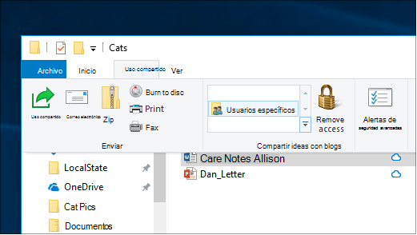

# Uso compartido de archivos en una red en Windows 10

**Nota**: si anteriormente usó grupo en el hogar para compartir archivos, tenga en cuenta que el grupo en el hogar se ha quitado de Windows 10 (versión 1803). Ahora puede compartir impresoras y archivos con las características integradas de Windows 10.

**Para compartir archivos o carpetas a través de una red**

- En **el explorador de archivos**, seleccione un archivo > haga clic en la ficha **compartir** situada en la parte superior > en la sección **compartir con** , haga clic en **personas específicas**.

    
          
- Si selecciona varios archivos a la vez, puede compartirlos todos de la misma manera. También funciona con carpetas.

**Para ver los dispositivos de la red que están compartiendo archivos**

- En el **Explorador de archivos**, vaya a **red**. Si la detección de redes no está habilitada, verá un mensaje de error "la detección de red está desactivada..."

- Haga clic en el banner la **detección de red está** desactivada y, a continuación, en **activar la detección de redes y el uso compartido de archivos**.

    

[Obtenga más información sobre el uso compartido de archivos en una red](https://support.microsoft.com/help/4092694/windows-10-file-sharing-over-a-network)

[Compartir archivos con aplicaciones, OneDrive, mensajes de correo electrónico y mucho más](https://support.microsoft.com/help/4027674/windows-10-share-files-in-file-explorer)
